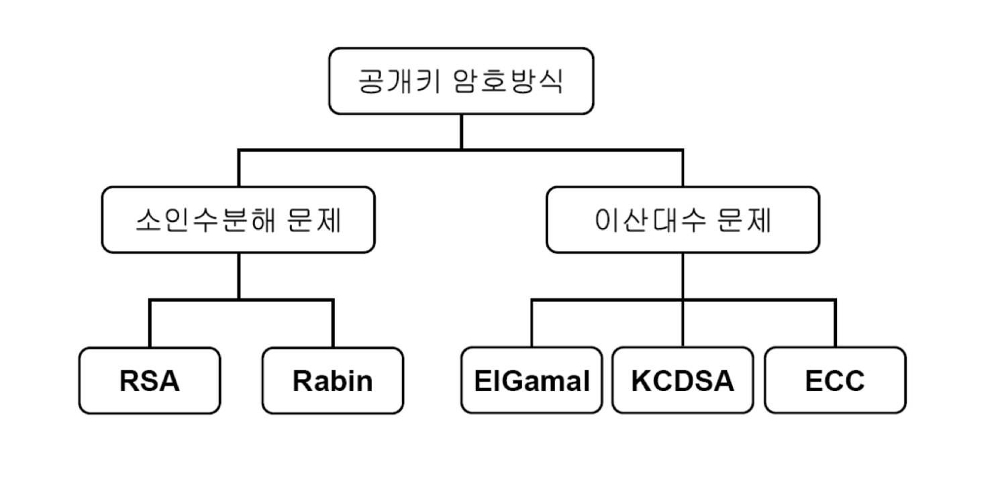

# 대칭키 방식

- 대칭키(Symmetric Key) 암호화 방식은 **암호화와 복호화에 같은 암호 키(대칭키)를 사용하는 암호화 알고리즘**
- 장점
  - 암호화 및 복호화가 빠르다.

- 단점

  - 암호화한 정보를 보낼 때 암호키도 함께 보내야해서 분실 또는 노출 위험이 있다.

- 대칭키 암호 시스템

  - DES, AES 등

  

# 공개키 방식(=비대칭키 방식)

- 공개키(Public Key) 암호화 방식은, **암호화와 복호화에 사용하는 암호키를 분리한 방식**
- 자신이 가지고 있는 고유한 암호키(비밀키, Private Key)로만 복호화할 수 있는 암호키(공개키, Public Key)를 대중에 공개한다.
- 공개키 암호화 방식 시나리오
  1. A가 웹 상에 공개된 'B의 공개키'를 이용하여 평문을 암호화
  2. B는 자신의 비밀키로 복호화한 평문을 확인하고, A의 공개키로 응답을 암호화하여 A에게 보냄
  3. A는 자신의 비밀키로 암호화된 응답문을 복호화함
- 장점
  - 암호키를 주고받아야하는 대칭키 방식의 문제점을 해결
- 단점
  - 암복호화가 매우 복잡: 암호화하는 키와 복호화하는 키가 서로 다르기 때문
- 공개키 암호 시스템
  - RSA, ECC 등

